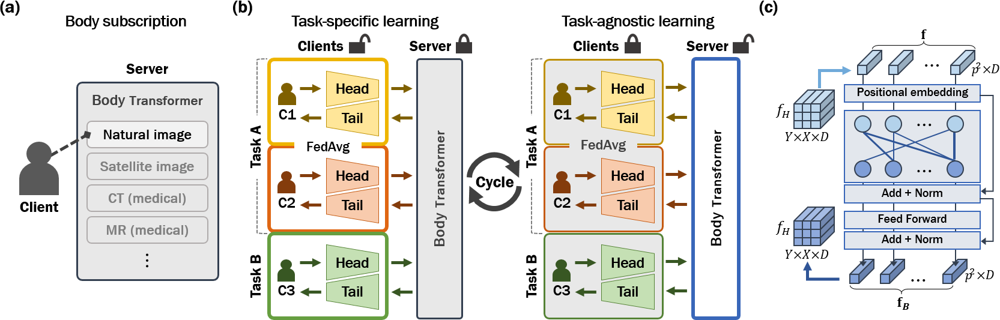
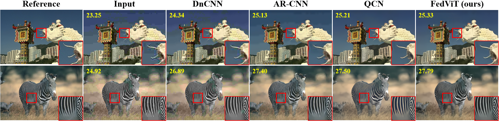
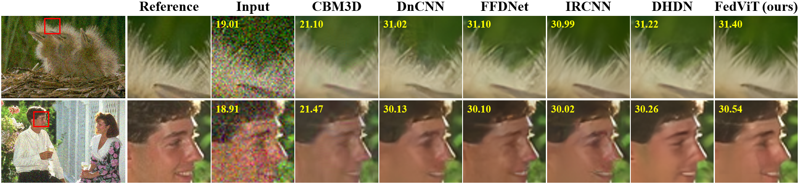
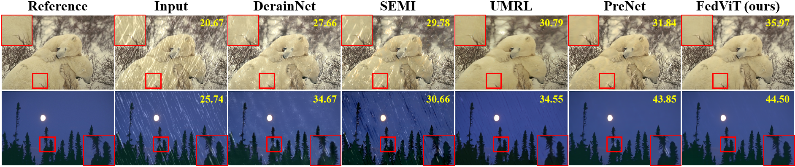
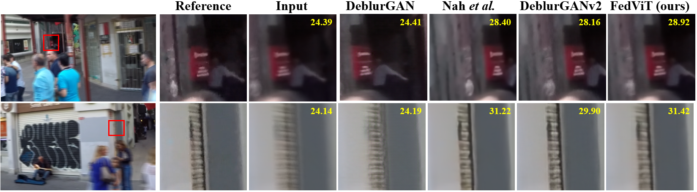

# TAViT: Privacy-preserving Task-Agnostic Vision Transformer for Image Processing

This repository is the official implementation of TAViT. 


## Requirements

To install requirements:

```setup
conda env create -f environment.yaml
```

## Evaluation
> 📋  The inference in this code is performed by stacking all patches of an input image in batch dimension, while we report results by testing the patches with batch size 1.

To evaluate our model on deblocking task with quality 10, run:

```eval
python deblocking_inference.py --Q=10
```

To evaluate our model on denoising task with σ=30, run:

```eval
python denoising_inference.py --mean=0 --std=30
```

To evaluate our model on deraining task, run:
```eval
python deraining_inference.py 
```

To evaluate our model on deblurring task, run:
```eval
python deblurring_inference.py  
```


## Pre-trained Models

You can download pre-trained model checkpoints (.pt) from the below link.
https://drive.google.com/drive/folders/1j_EXwzkMhl2y0TCsOnwg68lbYL0Q07RN?usp=sharing.

Copy downloaded checkpoint file to proper directory under 'inference/checkpoints'.

## Results

**Deblocking**


| Quality | Metric | Input | DnCNN | AR-CNN | QCN | Base | Single | Multi |
| --------|--------| ------| ------| -------| ----| -----| -------| ----- |
|    10   | PSNR<br>SSIM   | 25.67<br>0.719 | 26.70<br>0.755 | 26.42<br>0.777  |27.66<br>0.811| 27.67<br>0.785| 27.59<br>0.785  | 27.69<br>0.786 |
|    50   | PSNR<br>SSIM   | 31.51<br>0.902 | 32.70<br>0.918 | N/A<br>N/A  |33.00<br>0.934| 33.01<br>0.923| 32.93<br>0.924  | 33.20<br>0.924 |


**Denoising**

| Metric | Input | CBM3D | FFDNet | IRCNN | DHDN | SADNet | Base | Single | Multi |
|--------| ------| ------| -------| ------| -----| -------| -----| -------|-------|
| PSNR<br>SSIM | 19.03<br>0.336 | 29.71<br>0.843 | 30.32<br>0.860 | 30.31<br>0.860| 30.41<br>0.864| 30.64<br>N/A| 30.43<br>0.864 | 30.65<br>0.870 | 30.69<br>0.871|


**Deraining**

| Dataset | Metric | Input | DerainNet | SEMI | UMRL | PreNet | MSPFN | Base | Single | Multi |
| --------|--------| ------| ----------| -----| -----| -------| ------| ---- | ------ | ----- |
| Rain100H| PSNR<br>SSIM   | 12.13<br>0.349 | 14.92<br>0.592 | 16.56<br>0.486  |26.01<br>0.832| 26.77<br>0.858| 28.66<br>0.860 | 28.88<br>0.863 | 28.95<br>0.864 | 29.35<br>0.875|
| Rain100L| PSNR<br>SSIM   | 25.52<br>0.825 | 27.03<br>0.884 | 25.03<br>0.842 |29.18<br>0.923 |32.44<br>0.950|32.40<br>0.933 |32.93<br>0.937| 32.50<br>0.935  | 34.30<br>0.949 |


**Deblurring**

| Metric | Input | DeblurGAN | Nah et al. | Zhang et al. | DeblurGANv2 | Base | Single | Multi |
|--------| ------| ----------| -----------| -------------| ------------| -----| -------|-------|
| PSNR<br>SSIM | 25.64<br>0.790 | 28.70<br>0.858 | 29.08<br>0.914 | 29.19<br>0.931 | 29.55<br>0.934| 28.62<br>0.864 | 29.28<br>0.877 | 30.06 <br> 0.894|


## License
* We implemented out code based on Flower (https://github.com/adap/flower) which is under Apache License, Version 2.0. 

* See LICENSE for more information. 


## Data source
Data for each task can be downloaded at following links:
- PASCAL VOC 2012 : 
http://host.robots.ox.ac.uk/pascal/VOC/
- BSDS500 :
https://www2.eecs.berkeley.edu/Research/Projects/CS/vision/grouping/resources.html
- Deraining :
    - Rain1400 : 
    https://xueyangfu.github.io/projects/cvpr2017.html
    - Rain1800 : 
    https://www.icst.pku.edu.cn/struct/Projects/joint\_rain\_removal.html
    - Rain800 : 
    https://github.com/hezhangsprinter/ID-CGAN
    - Rain12 : 
    https://yu-li.github.io/
    - Rain100L/Rain100H : 
    https://www.icst.pku.edu.cn/struct/Projects/joint_rain_removal.html

- GoPro :
https://seungjunnah.github.io/Datasets/gopro.html

